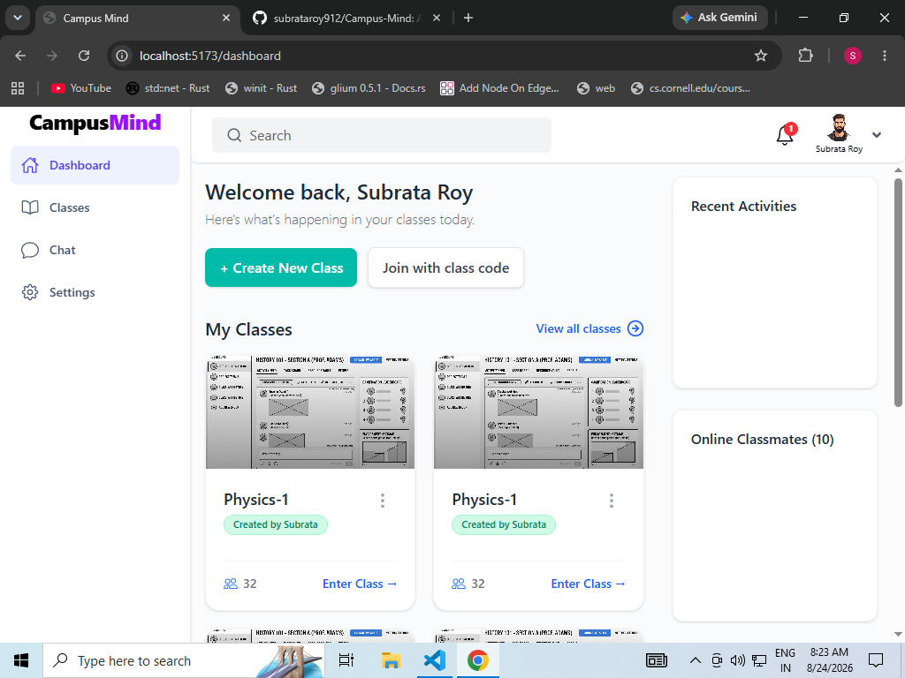

# 🎓 Classroom Chat Platform

### A modern classroom, assignment, study material, grading & real-time communication platform.

  

  
  
  
  

  <strong>Clean UI • Real-Time Chat • Assignments • Materials • Grading • Notifications</strong>

---

## 🌐 Live Demo

  

