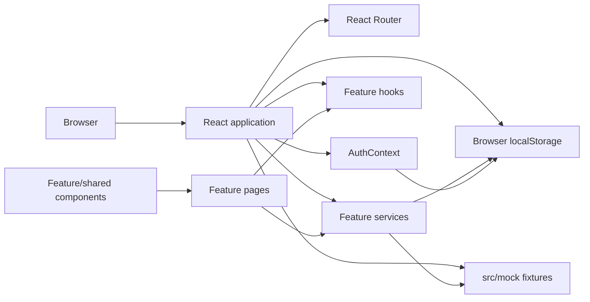
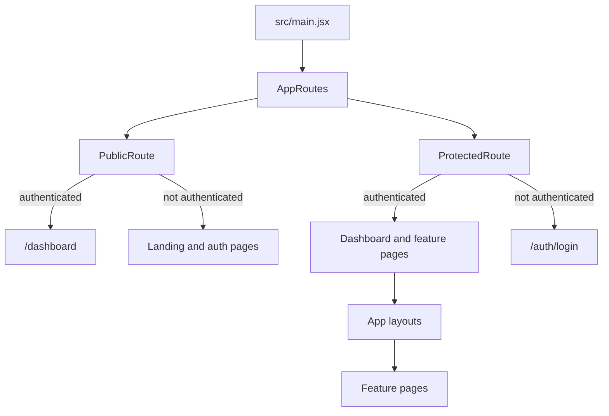
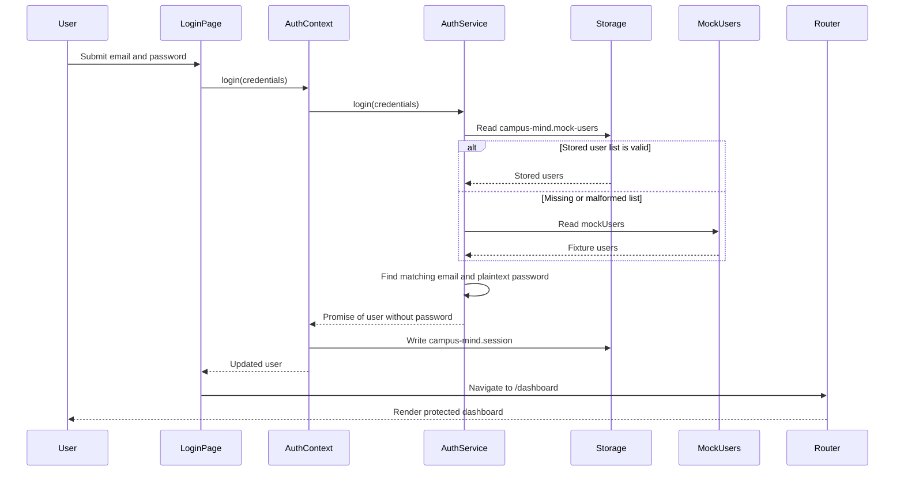
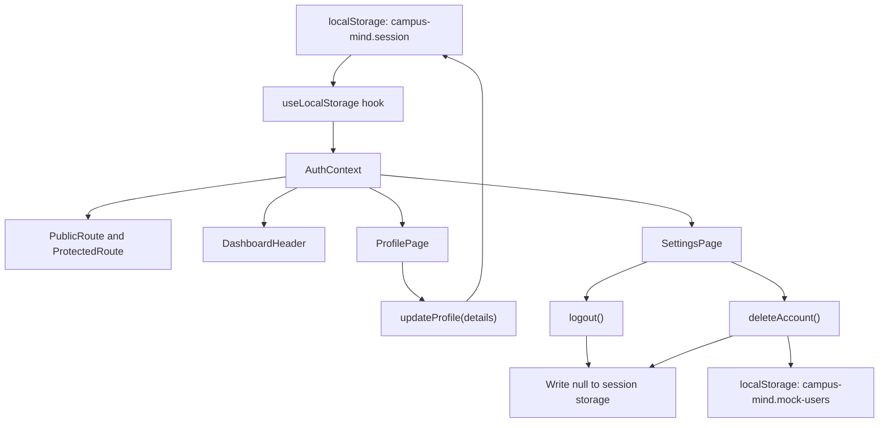
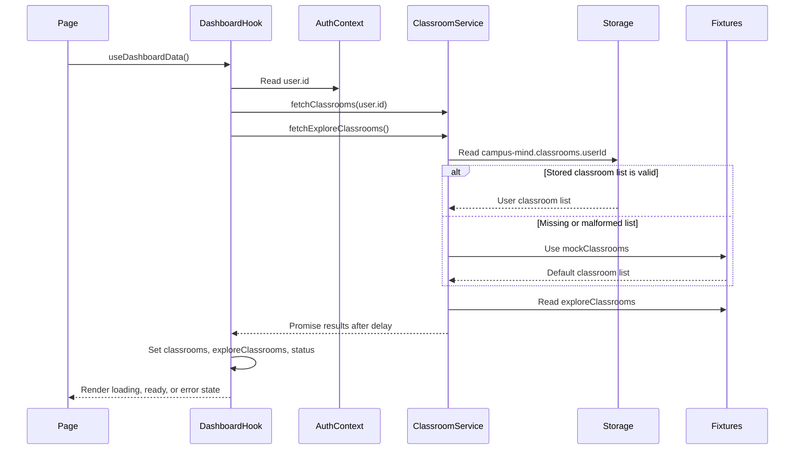
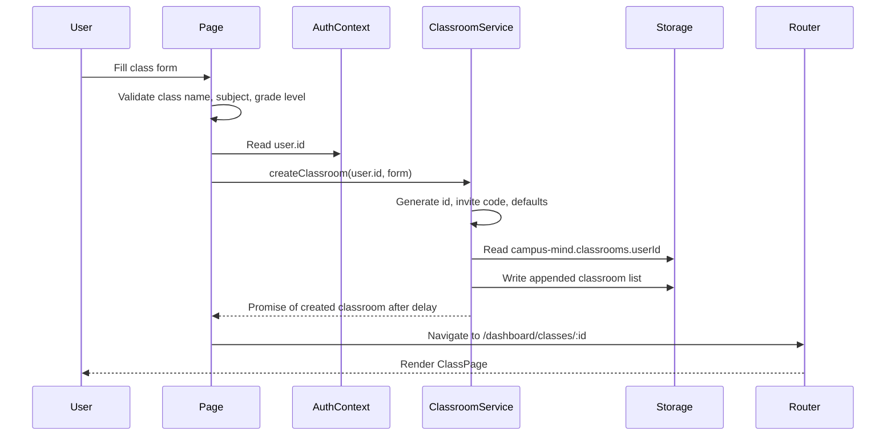
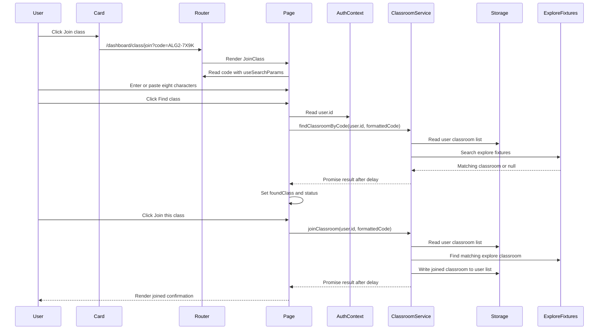

# Campus Mind Data Flow

This document describes the current runtime data flow of Campus Mind. It reflects the browser-only implementation as it exists today: React state, Context API, mock fixtures, and localStorage. It does not describe a future backend design.

## System Boundary



There is currently no backend server, HTTP client, API endpoint, database, WebSocket connection, or environment-based API configuration.

## Application Startup

```text
index.html
  -> src/main.jsx
    -> StrictMode
    -> TooltipProvider
    -> AuthProvider
      -> useLocalStorage("campus-mind.session", null)
      -> RouterProvider(AppRoutes)
        -> lazy route module loading
        -> Suspense fallback while lazy modules load
```

`AuthProvider` is the main application-wide state provider. Route guards consume it before rendering public or protected route content.

## Route and Guard Flow



The session object in `campus-mind.session` is treated as the authentication authority. There is no server validation or token refresh.

# Authentication Data Flow

## Login



### Login ownership

| Layer | Current responsibility |
|---|---|
| View | Collects credentials, displays loading/errors, navigates after success |
| Context | Exposes `login`, stores the current user, derives `isAuthenticated` |
| Service | Reads users, validates credentials, removes password from returned session object, simulates 300 ms latency |
| Storage | Stores registered users and active session |
| Fixtures | Provides fallback demo users and demo-account picker data |

Relevant files:

- [LoginPage.jsx](../src/features/auth/pages/LoginPage.jsx)
- [AuthContext.jsx](../src/context/AuthContext.jsx)
- [authService.js](../src/features/auth/api/authService.js)
- [useLocalStorage.js](../src/hooks/useLocalStorage.js)
- [mockUsers.js](../src/mock/mockUsers.js)

## Registration

```text
RegisterPage
  -> AuthContext.register(details)
    -> authService.register(details)
      -> users()
        -> localStorage["campus-mind.mock-users"]
        -> fallback mockUsers
      -> check duplicate email
      -> create user object with plaintext password
      -> write updated user list to localStorage
      -> wait 300 ms
    -> navigate to /auth/login with location.state.registered = true
```

The registration result excludes the password, but the stored user record includes it in plaintext because this is a local demo implementation.

## Session, Logout, Profile, and Delete



Profile updates currently change only the active session object. They do not update the matching record in `campus-mind.mock-users`, so the change can be lost after a fresh login.

# Classroom Data Flow

## Dashboard classroom loading



`useDashboardData()` is not globally cached. Each component that calls the hook creates its own state and starts its own requests.

Relevant files:

- [useDashboardData.js](../src/features/dashboard/useDashboardData.js)
- [classroomService.js](../src/features/classroom/api/classroomService.js)
- [DashboardHomePage.jsx](../src/features/dashboard/pages/DashboardHomePage.jsx)
- [ProfilePage.jsx](../src/features/profile/pages/ProfilePage.jsx)
- [DashboardCommunityPage.jsx](../src/features/dashboard/pages/DashboardCommunityPage.jsx)
- [DashboardAssignmentPage.jsx](../src/features/dashboard/pages/DashboardAssignmentPage.jsx)

## Opening a classroom

```text
ClassPage
  -> useParams()
    -> classId from /dashboard/classes/:classId
  -> useClassroom(classId)
    -> useAuth()
      -> user.id
    -> findClassroomById(user.id, classId)
      -> read(user.id)
        -> localStorage["campus-mind.classrooms.<userId>"]
        -> fallback mockClassrooms
      -> delay 300 ms
  -> classroom/error state
  -> render classroom components
```

The classroom record is service-loaded, but the classroom home content is fixture-driven:

- `PINNED_ANNOUNCEMENT`
- `FEED_POSTS`
- `TODO_ITEMS`
- `ACTIVE_NOW`
- `QUICK_LINKS`

These are defined in [classPageData.js](../src/features/classroom/data/classPageData.js).

## Creating a classroom



The selected cover image is converted to a data URL in the page and passed to the service. The original `File` object is not a backend upload.

## Joining a classroom



Relevant files:

- [ExploreClassCard.jsx](../src/features/dashboard/components/ExploreClassCard.jsx)
- [JoinClass.jsx](../src/features/classroom/pages/JoinClass.jsx)
- [classCode.js](../src/utils/classCode.js)
- [classroomService.js](../src/features/classroom/api/classroomService.js)

## Classroom storage behavior

Current keys:

```text
campus-mind.classrooms.<userId>
```

Important behavior:

- Created and joined classrooms are written per user.
- Missing user storage falls back to the shared `mockClassrooms` fixture.
- Explore classrooms always come from `exploreClassrooms.js`.
- Classroom service methods simulate asynchronous network behavior with a 300 ms delay.
- No classroom data is sent to a server.

# Other Feature Data Flows

## Community

```text
DashboardCommunityPage
  -> import COMMUNITY_POSTS and COMMUNITY_FILTERS from mockCommunityPosts.js
  -> useDashboardData() only to determine whether the user has classes
  -> local useState for active filter, draft, likes, and like counts
  -> render filtered mock posts
```

Community posts are not loaded through a service and are not persisted. Posting is currently a UI-only control with no mutation handler.

## Messages

```text
DashboardMessagesPage
  -> import CONVERSATIONS from mockMessages.js
  -> local state for query and active conversation
  -> ChatThread copies conversation.messages into local state
  -> sending appends to local React state only
```

Messages disappear when the page unmounts or the browser refreshes.

## Assignments

```text
DashboardAssignmentPage
  -> import ASSIGNMENTS and ASSIGNMENT_FILTERS from mockAssignments.js
  -> useDashboardData() only to determine whether the user has classes
  -> local state for filter and completion status
  -> completion toggles update local React state only
```

Assignment completion is not persisted and has no service/API boundary.

## Saved items

```text
DashboardSavedPage
  -> defines collections and saved items directly in the page module
  -> local state for filters, search, collections, and unsaving
```

Saved data is neither imported from a service nor persisted to localStorage.

## Settings

```text
SettingsPage
  -> local state for notifications and privacy
  -> local state initialized from localStorage for theme
  -> useEffect toggles document.documentElement.dark
  -> writes campus-mind.theme to localStorage
```

Theme is the only settings value persisted. Notification and privacy changes are local to the mounted page.

# State Ownership Map

| State | Runtime owner | Persistence | Source |
|---|---|---|---|
| Current user | `AuthContext` and `useLocalStorage` | `campus-mind.session` | Auth service result |
| Authentication status | Derived in `AuthContext` | Derived | `Boolean(user)` |
| Registered users | `authService` | `campus-mind.mock-users` | `mockUsers.js` fallback |
| User classrooms | `useDashboardData`, `useClassroom` | `campus-mind.classrooms.<userId>` | `mockClassrooms.js` fallback |
| Explore classrooms | `useDashboardData` | None | `exploreClassrooms.js` |
| Classroom detail content | `ClassPage` and feature data module | None | `classPageData.js` |
| Join code | `JoinClass` local state | URL initializes it | `useSearchParams` |
| Classroom ID | `ClassPage` URL params | URL | `useParams` |
| Reset token | `ResetPasswordPage` URL params | URL | `useSearchParams` |
| Dashboard filters | Individual page state | None | User interaction |
| Chat messages | `ChatThread` local state | None | `mockMessages.js` initial data |
| Assignment completion | Assignment page state | None | `mockAssignments.js` initial data |
| Notifications | Settings page state | None | Default constants |
| Privacy | Settings page state | None | Default constants |
| Theme | Settings page state and document class | `campus-mind.theme` | Browser preference |

# Coupling and Backend Migration Risks

## Direct mock imports from UI

The following feature pages directly import mock data:

- Login demo-account picker imports `mockUsers`.
- Assignment page imports `mockAssignments`.
- Community page imports `mockCommunityPosts`.
- Messages page imports `mockMessages`.

These pages know fixture structure and own data initialization, so a backend integration would require changing page implementations rather than swapping a service adapter.

## Direct localStorage access from UI

`SettingsPage` directly reads and writes localStorage for the theme. Auth and classroom storage are more centralized behind hooks/services.

## Async behavior is inconsistent

Async simulation exists in:

- `authService.login`
- `authService.register`
- classroom service reads and mutations

Synchronous or local-only behavior exists in:

- profile updates
- theme persistence
- notification toggles
- privacy toggles
- message sending
- assignment completion
- saved item mutations

This means loading, retry, and failure states are not consistent across features.

## Data shape and authority risks

- Passwords are stored in plaintext in the demo user list.
- Profile updates modify the session but not the stored user record.
- Deleting a user does not remove `campus-mind.classrooms.<userId>`.
- Missing classroom storage falls back to the same mock classrooms for every user.
- Each `useDashboardData()` call has independent state and no shared cache.
- Classroom home content remains fixture-driven even when the classroom record is loaded through a service.

# Backend Migration Seams

The cleanest existing seam is:

```text
Page
  -> feature hook
    -> feature service
      -> localStorage/mock implementation
```

The classroom area already follows this pattern most closely. The future backend migration should preserve the page-facing service contracts and replace the storage implementation behind them.

The least isolated areas are community, messages, assignments, saved items, and settings because their pages import fixtures or directly own the data lifecycle.
